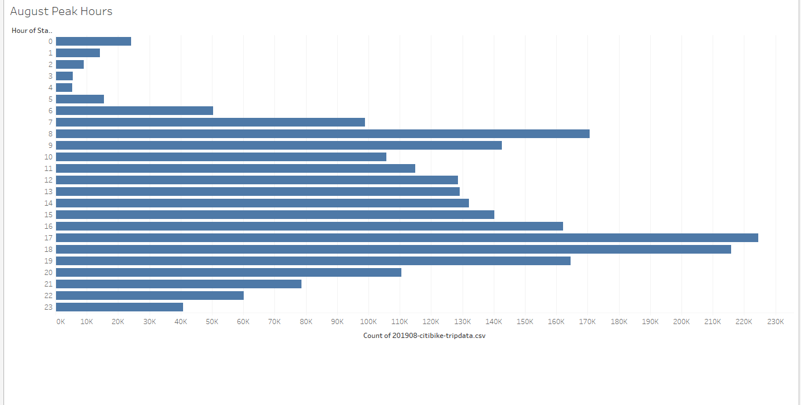

# Bikesharing
## Overview

This analysis is mainly being conducted to understand the bike sharing platform of New York, study some key points in the usage around the peak months and try to use it to implement it for the Des Moines city based on some commonalities.

## Results

- In August the peak hours are mostly 7 am to 8 am and 5pm to 6 pm. This could suggest many office commuters using it to travel between home and office.

- out of the 2.3 mn counts of tripdata that occurred in August 65% was dominated by males and 25% by females
- During the month more than 80% of the trip durations lasted for less than 1 hour which suggests that they were mostly used to reach from a point to other not far away from one another
- More than 80% of those were utilised by male customers suggesting the utilisation was driven by males.
- On weekdays the peak hours were mostly 7 am to 8 am and 5pm to 6 pm, but on weekends this changed to from morning 9 to evening 6 which suggest leisure usage by customers
- For the gender wise trips on weekdays the trend followed closely for the males like the ones in the top graph. For females it was somewhat similar
- majority of the users were found to be male subscribers followed by female subscribers. Almost 81 % users were subscribers.

## Summary
- It is clear that the peak months for the bike sharing will be during summer and spring seasons since larger number of customers may opt for using bikes for commute during those months
- Also gender wise males are more interested in opting for commuting using a bike than females but the mix can differ based on the city demographics
- Also, key locations of NYC where the usage of bike sharing high can be highlighted and a similar trend can be applied for Des Moines
- weekend and holiday trends can help to understand what are the key tourist spots that people visit in NYC. A similar mapping of Des Moines can help to set up tourist friendly spots for installing bike sharing stations for increased use by tourist.
